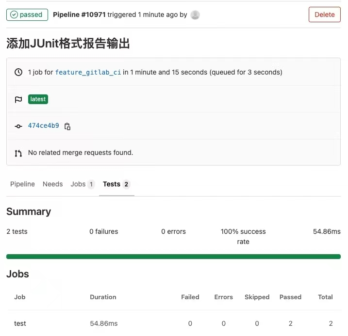

# Unity单元测试和Gitlab自动化集成（三）：在GitLab的CI中集成Unity单元测试

## 在GitLab的CI中运行Unity单元测试

Gitlab的CI是一个非常强大的工具，它可以帮助我们自动化构建、测试、部署项目。在上一章我们已经在本地使用NUnit来运行Unity单元测试了，现在我们来看看如何在GitLab的CI中运行Unity单元测试。

首先，我们需要在GitLab上创建一个项目，然后在项目的根目录下创建一个.gitlab-ci.yml文件，内容如下：

```yaml
stages:
  - test

test:
  stage: test
  resource_group: client
  script: 
    - $UNITY_APP -runTests -batchmode -nographics -projectPath -testResults result.xml
```

这个文件定义了一个test的stage，然后在test stage中定义了一个test的job。在test job中，我们使用了一个名为$UNITY_APP的变量，这个变量的值是Unity的命令行工具的路径。在GitLab的CI中，我们可以使用variables关键字来定义变量，然后在script中使用这些变量。我们可以在GitLab的CI中使用的变量有很多，比如$CI_PROJECT_DIR，它表示项目的根目录。我们可以在GitLab的CI中使用的变量列表可以参考[这里](https://docs.gitlab.com/ee/ci/variables/predefined_variables.html)。

运行上面的脚本，我们可以看到GitLab的CI中运行了Unity的测试：


但是在这里Tests的数量是0，也就是Gitlab没有认出我们的测试报告，因为我们需要添加一个配置项告诉Gitlab我们的测试报告文件。配置内容如下：

```yaml
stages:
  - test

test:
  stage: test
  resource_group: client
  script: 
    - $UNITY_APP -runTests -batchmode -nographics -projectPath -testResults result.xml
  artifacts:
    reports:
      junit: result.xml
    expire_in: 1 mos
```

这里我们使用了artifacts关键字来定义测试报告文件，然后在reports关键字下定义了测试报告文件的类型和路径。在GitLab的CI中，我们可以使用artifacts关键字来定义测试报告文件，然后在reports关键字下定义了测试报告文件的类型和路径。我们可以在GitLab的CI中使用的变量列表可以参考[这里](https://docs.gitlab.com/ee/ci/yaml/README.html#artifactsreports)。

上面的配置里，我们定义了测试报告文件的类型为junit，这是因为GitLab的CI只支持junit格式的测试报告文件。由于Unity只支持NUnit，而NUnit不支持junit格式的测试报告文件，所以我们需要对NUnit的测试结果做个处理，然后再生成junit格式的测试报告文件。

> 由于没找到好用的NUnit转junit的工具，所以还是自己写一个吧。

Unity中有一个UnityEditor.TestTools.TestRunner.Api.ICallbacks的interface，代码如下：

```csharp
namespace UnityEditor.TestTools.TestRunner.Api
{
    /// <summary>
    /// Callbacks in the <see cref="TestRunnerApi"/> for the test stages when running tests. 
    /// </summary>
    public interface ICallbacks
    {
        /// <summary>
        /// A callback invoked when a test run is started.
        /// </summary>
        /// <param name="testsToRun">The full loaded test tree.</param>
        void RunStarted(ITestAdaptor testsToRun);
        /// <summary>
        /// A callback invoked when a test run is finished.
        /// </summary>
        /// <param name="result">The result of the test run.</param>
        void RunFinished(ITestResultAdaptor result);
        /// <summary>
        /// A callback invoked when each individual node of the test tree has started executing.
        /// </summary>
        /// <param name="test">The test node currently executed.</param>
        void TestStarted(ITestAdaptor test);
        /// <summary>
        /// A callback invoked when each individual node of the test tree has finished executing.
        /// </summary>
        /// <param name="result">The result of the test tree node after it had been executed.</param>
        void TestFinished(ITestResultAdaptor result);
    }
}
```

在TestRunnerApi中注册一个ICallbacks的实例，我们就可以通过RunFinished来接收测试结果，然后再生成junit格式的测试报告文件。JUnit的格式可以参考[这里](https://www.ibm.com/docs/zh/developer-for-zos/9.5.1?topic=formats-junit-xml-format)。从ITestResultAdaptor生成JUnit格式的测试报告文件的代码如下：

```csharp
public static class JUnitGenerator
{
    public static XmlDocument Generate(ITestResultAdaptor result)
    {
        var xmlDoc = new XmlDocument();
        var xmlDecl = xmlDoc.CreateXmlDeclaration("1.0", "UTF-8", null);
        xmlDoc.AppendChild(xmlDecl);

        XmlNode rootNode = xmlDoc.CreateElement("testsuites");
        var rootAttrId = xmlDoc.CreateAttribute("id");
        rootAttrId.Value = result.Test.Id;
        rootNode.Attributes.Append(rootAttrId);
        var rootAttrName = xmlDoc.CreateAttribute("name");
        rootAttrName.Value = result.Test.Name;
        rootNode.Attributes.Append(rootAttrName);
        var rootAttrTests = xmlDoc.CreateAttribute("tests");
        rootAttrTests.Value = result.PassCount.ToString();
        rootNode.Attributes.Append(rootAttrTests);
        var rootAttrFailures = xmlDoc.CreateAttribute("failures");
        rootAttrFailures.Value = result.FailCount.ToString();
        rootNode.Attributes.Append(rootAttrFailures);
        var rootAttrTime = xmlDoc.CreateAttribute("time");
        rootAttrTime.Value = result.Duration.ToString();
        rootNode.Attributes.Append(rootAttrTime);
        xmlDoc.AppendChild(rootNode);
            
        foreach (var child in result.Children)
        {
            ProcessChild(xmlDoc, rootNode, rootNode, child);
        }
        return xmlDoc;
    }
    
    private static bool ProcessChild(XmlDocument xmlDoc, XmlNode rootNode, XmlNode current, ITestResultAdaptor result)
    {
        if (result.Children.Any())
        {
            var testSuiteNode = xmlDoc.CreateElement("testsuite");
            
            var isLeaf = false;
            foreach (var child in result.Children)
            {
                isLeaf = ProcessChild(xmlDoc, rootNode, testSuiteNode, child) || isLeaf;
            }

            if (isLeaf)
            {
                var testSuiteAttrId = xmlDoc.CreateAttribute("id");
                testSuiteAttrId.Value = result.Test.Id;
                testSuiteNode.Attributes.Append(testSuiteAttrId);
                var testSuiteAttrName = xmlDoc.CreateAttribute("name");
                testSuiteAttrName.Value = result.FullName;
                testSuiteNode.Attributes.Append(testSuiteAttrName);
                var testSuiteAttrTests = xmlDoc.CreateAttribute("tests");
                testSuiteAttrTests.Value = result.PassCount.ToString();
                testSuiteNode.Attributes.Append(testSuiteAttrTests);
                var testSuiteAttrFailures = xmlDoc.CreateAttribute("failures");
                testSuiteAttrFailures.Value = result.FailCount.ToString();
                testSuiteNode.Attributes.Append(testSuiteAttrFailures);
                var testSuiteAttrTime = xmlDoc.CreateAttribute("time");
                testSuiteAttrTime.Value = result.Duration.ToString();
                testSuiteNode.Attributes.Append(testSuiteAttrTime);
                rootNode.AppendChild(testSuiteNode);
            }
            return false;
        }
        else
        {
            var testCaseNode = xmlDoc.CreateElement("testcase");
            var testCaseAttrId = xmlDoc.CreateAttribute("id");
            testCaseAttrId.Value = result.Test.Id;
            testCaseNode.Attributes.Append(testCaseAttrId);
            var testCaseAttrName = xmlDoc.CreateAttribute("name");
            testCaseAttrName.Value = result.FullName;
            testCaseNode.Attributes.Append(testCaseAttrName);
            var testCaseAttrTime = xmlDoc.CreateAttribute("time");
            testCaseAttrTime.Value = result.Duration.ToString();
            testCaseNode.Attributes.Append(testCaseAttrTime);
            if (result.TestStatus == TestStatus.Failed)
            {
                var failureNode = xmlDoc.CreateElement("failure");
                var failureAttrType = xmlDoc.CreateAttribute("type");
                failureAttrType.Value = result.TestStatus.ToString();
                failureNode.Attributes.Append(failureAttrType);
                var failureAttrMessage = xmlDoc.CreateAttribute("message");
                failureAttrMessage.Value = result.Message;
                failureNode.Attributes.Append(failureAttrMessage);
                failureNode.InnerText = result.StackTrace;
                testCaseNode.AppendChild(failureNode);
            }
            current.AppendChild(testCaseNode);
            return true;
        }
    }
}
```

然后，我们实现ICallbacks接口，将测试结果写入到文件中：

```csharp
public class Callback : ICallbacks
{
    public void RunStarted(ITestAdaptor testsToRun)
    {
    }

    public void RunFinished(ITestResultAdaptor result)
    {
        var reportPath = string.Empty;
        // 从命令行参数中获取junit报告文件的路径
        var args = Environment.GetCommandLineArgs();
        for (var i = 0; i < args.Length; i++)
        {
            if (args[i] != "-junit")
            {
                continue;
            }
            
            reportPath = args[i + 1];
            break;
        }

        // 如果没有指定junit报告文件的路径，则默认为当前目录下的junit.xml
        if (string.IsNullOrEmpty(reportPath)) {
            reportPath = "junit.xml";
        }
        
        var xmlDoc = JUnitGenerator.Generate(result);
        
        xmlDoc.Save(reportPath);
    }

    public void TestStarted(ITestAdaptor test)
    {
    }

    public void TestFinished(ITestResultAdaptor result)
    {
    }
}
```

最后，找个地方将Callback注册到TestRunnerApi中，这里我们使用了NUnit的一个特性：[SetUpFixture](https://docs.nunit.org/articles/nunit/writing-tests/attributes/setupfixture.html)。这个特性可以用来在测试开始前和结束后执行一些操作，我们可以在这里注册Callback：

```csharp
[SetUpFixture]
public class Global
{
    [OneTimeSetUp]
    public void Setup()
    {
        var api = ScriptableObject.CreateInstance<TestRunnerApi>();
        api.RegisterCallbacks(new Callback());
    }
    
    [OneTimeTearDown]
    public void TearDown()
    {
        
    }
}
```

这样，我们就可以在运行测试时，通过命令行参数指定junit报告文件的路径了，修改后的gitlab-ci配置如下：

```yaml
stages:
  - test

test:
  stage: test
  resource_group: client
  script: 
    - $UNITY_APP -runTests -batchmode -nographics -projectPath -junit result.xml
  artifacts:
    reports:
      junit: result.xml
    expire_in: 1 mos
```

运行结果如下：



在创建合并请求的时候，也可以看到测试结果：

