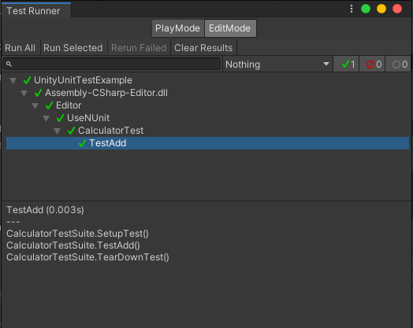
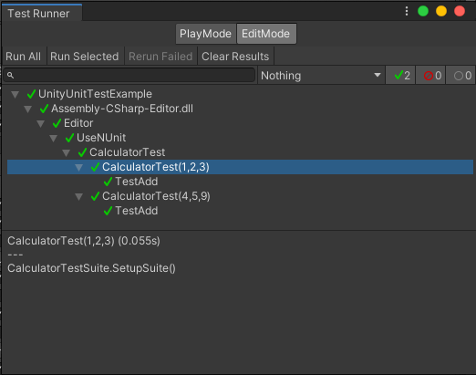

# Unity单元测试和Gitlab自动化集成（二）：使用NUnit进行单元测试

## 使用NUnit的单元测试编写

上一章我们编写了一个简单的单元测试框架，这次我们使用NUnit来替换掉这个框架。代码如下：

```csharp
[TestFixture]
public class CalculatorTest
{
    private Calculator _calculator;

    [OneTimeSetUp]
    protected void SetupSuite()
    {
        Debug.Log("CalculatorTestSuite.SetupSuite()");
        _calculator = new Calculator();
    }

    [OneTimeTearDown]
    protected void TearDownSuite()
    {
        Debug.Log("CalculatorTestSuite.TearDownSuite()");
        _calculator = null;
    }
    
    [SetUp]
    protected void SetupTest()
    {
        Debug.Log("CalculatorTestSuite.SetupTest()");
    }
    
    [TearDown]
    protected void TearDownTest()
    {
        Debug.Log("CalculatorTestSuite.TearDownTest()");
    }

    [Test]
    public void TestAdd()
    {
        Debug.Log("CalculatorTestSuite.TestAdd()");
        var result = _calculator.Add(1, 2);
        Assert.AreEqual(3, result);
    }
}
```

NUnit使用Attribute来标记测试套件和测试用例。以下是NUnit的Attribute列表：

* [TestFixture]：标记测试套件，对应我们的TestSuiteAttribute
* [OneTimeSetUp]：标记测试套件的SetupSuite方法
* [OneTimeTearDown]：标记测试套件的TearDownSuite方法
* [SetUp]：标记测试用例的SetupTest方法
* [TearDown]：标记测试用例的TearDownTest方法
* [Test]：标记测试用例，对应我们的TestAttribute

NUnit同样提供了Assert类，用于断言测试结果。

## 在Unity中运行NUnit

点击菜单栏的Window->General->Test Runner，打开Test Runner窗口。然后，点击Test Runner窗口的Run All按钮，运行所有的测试用例。



## 在命令行中运行Unity的测试

我们可以使用Unity的命令行工具来运行Unity的测试。命令行工具的路径为：

```
<Unity安装目录>\Editor\Unity.exe
```
Mac上的路径为：

```
/Applications/Unity/Unity.app/Contents/MacOS/Unity
```

我们可以使用下面的命令来运行Unity的测试：

```
<Unity安装目录>\Editor\Unity.exe -runTests -batchmode -nographics -projectPath <项目路径> -testResults <测试结果文件路径>
```
> 通过命令行执行测试的时候要注意，-quit参数不能使用，否则测试无法运行

## 给测试用例添加初始条件

可以在TestFixture添加参数，这些参数会传入到测试用例的构造函数中。这样我们就可以在测试用例的构造函数中初始化测试用例的初始条件。

```csharp
[TestFixture(1, 2, 3)]
[TestFixture(4, 5, 9)]
public class CalculatorTest
{
    private readonly int _a;
    private readonly int _b;
    private readonly int _expected;
    public CalculatorTest(int a, int b, int expected)
    {
        _a = a;
        _b = b;
        _expected = expected;
    }
    private Calculator _calculator;

    [OneTimeSetUp]
    protected void SetupSuite()
    {
        Debug.Log("CalculatorTestSuite.SetupSuite()");
        _calculator = new Calculator();
    }

    [OneTimeTearDown]
    protected void TearDownSuite()
    {
        Debug.Log("CalculatorTestSuite.TearDownSuite()");
        _calculator = null;
    }
    
    [SetUp]
    protected void SetupTest()
    {
        Debug.Log("CalculatorTestSuite.SetupTest()");
    }
    
    [TearDown]
    protected void TearDownTest()
    {
        Debug.Log("CalculatorTestSuite.TearDownTest()");
    }

    [Test]
    public void TestAdd()
    {
        Debug.Log("CalculatorTestSuite.TestAdd()");
        var result = _calculator.Add(_a, _b);
        Assert.AreEqual(_expected, result);
    }
}
```

上面代码将TestAdd方法的初始条件从代码中抽离出来，放到TestFixture的参数中。这样我们就可以在TestFixture的参数中定义多组初始条件，从而实现测试用例的参数化。

打开Test Runner窗口，可以看到测试用例的名称中包含了TestFixture的参数。

